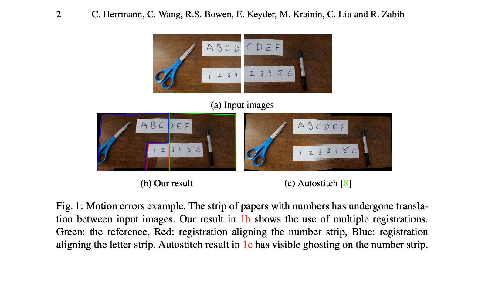
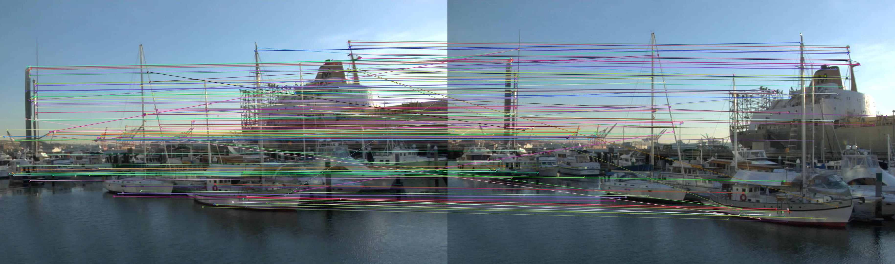
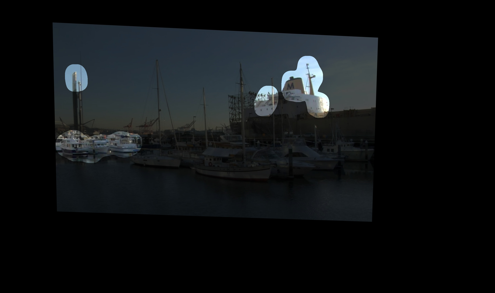
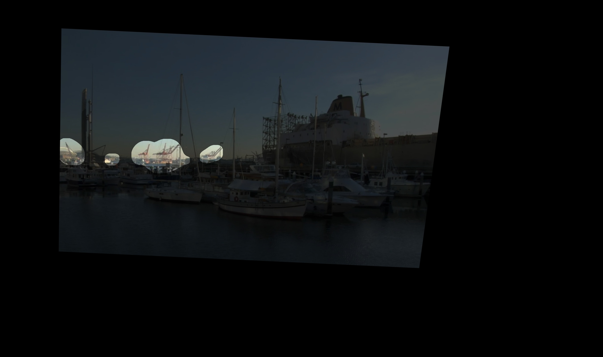
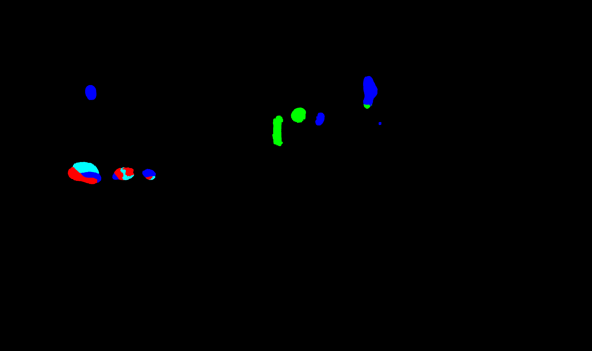

# Robust Multi-Registration Image Stitching (Unofficial)


*Final non-rigidly refined and blended panorama using multiple registrations.*

Unofficial research implementation inspired by **“Robust Image Stitching with Multiple Registrations.”**

## Usage

```python
from features import detect_and_describe, match_descriptors, matched_points
from candidate_generation import generate_candidate_homographies
from run_unary_selection import main as run_stitching

# Option 1: Run the full pipeline via script
# python3 run_unary_selection.py --ref "ref.png" --src "src.png"

# Option 2: Programmatic access (Logic flow)
candidates = generate_candidate_homographies(
    pts_src=pts_src,
    pts_ref=pts_ref,
    src_image_shape=src_img.shape,
    max_candidates=10
)

# Candidates are then scored, pruned, and blended locally
# to resolve parallax and motion ghosting.
```

## Why this repo exists

Standard panorama stitching often fails when different scene parts lie at different depths, leading to visible ghosting or tearing:


*Typical "ghosting" errors in single-homography stitching due to parallax or motion.*

This repo follows the idea of generating several plausible registrations and deciding **which registration to trust where**.


Or, if you want to perform custom refinement on individual local registrations:

```python
from local_warp import build_apap_field, warp_image_apap

# Build non-rigid deformation field for a specific candidate
field = build_apap_field(
    pts_src=local_pts_src,
    pts_ref=local_pts_ref,
    src_shape=src_img.shape,
    global_H=candidate_H
)

# Warp image with local refinement
warped, mask, _, _ = warp_image_apap(src_img, field, T=canvas_T)
```

## Current Pipeline

### 1. Feature Matching

*SIFT feature correspondences between the reference and source images.*

- SIFT features
- ratio-test and cross-check matching
- dense enough matching for candidate generation

### 2. Candidate Homography Generation
- repeated localized RANSAC
- local support neighborhoods
- geometric plausibility checks
- duplicate removal

### 3. Shared Global Canvas
All candidates and the reference image are warped into a single common output coordinate system.

### 4. Confidence Maps
Each candidate gets a motion-confidence map from its inlier support.

### 5. Support Masks
Candidates are only allowed to compete where they are actually trusted.

This is important because a homography may technically cover a huge area while only being locally meaningful.



*Visualizing the localized support regions for various candidate homographies.*

### 6. Candidate Pruning
Candidates are ranked and pruned using support-mask area so that only the most useful local alternatives remain.

### 7. Label Selection
A cost volume is built over:
- reference image
- surviving candidate warps

A label is chosen per pixel.

### 8. Label Refinement

*Final label map after spatial smoothing and seam-aware refinement. Colors correspond to different candidate registrations.*

- Local smoothing and seam-aware refinement reduce noisy patch selection.

### 9. Feather Blending
- Selected candidate regions are softly blended back into the reference using distance transforms from the support boundaries.

## Modes

### `rigid`
Default and recommended.

Uses:
- rigid homographies
- support-mask gating
- candidate pruning
- label refinement
- feather blending

This is the most stable mode.

### `hybrid`
Experimental.

Intended for future use when one selected local candidate is refined further while the rest remain rigid.

### `apap_experimental`
Research sandbox only.

An APAP-style local warp prototype exists, but it is **not yet robust enough** for the main pipeline.

## What Works Well

### Boat Dataset
The pipeline successfully:
- finds many plausible candidates
- prunes them to a few local alternatives
- uses support masks to avoid meaningless full-plane competition
- keeps the reference as the dominant source while selecting local alternate patches where useful

### Ambiguous Toy Scenes
For small ambiguous examples such as the paper-strip test pair, the system may return **no valid candidates**.

This is the intended behavior under strict geometric filtering. Failure is preferred over producing nonsense warps.

## Citation

If you use this repo, please cite the original paper:

```bibtex
@article{herrmann2020robust,
  title={Robust image stitching with multiple registrations},
  author={Herrmann, Charles and Wang, Chen and Bowen, Richard Strong and Keyder, Emil and Krainin, Michael and Liu, Ce and Zabih, Ramin},
  journal={arXiv preprint arXiv:2011.11784},
  year={2020}
}
```
